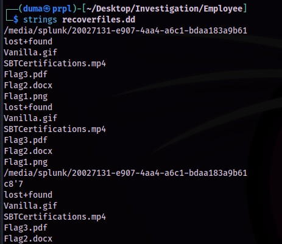
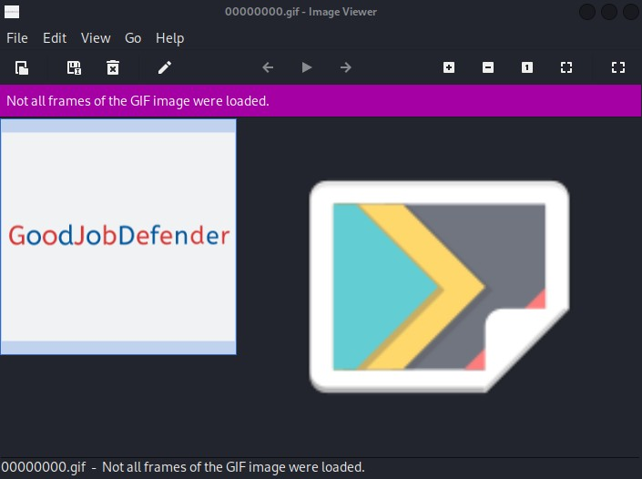
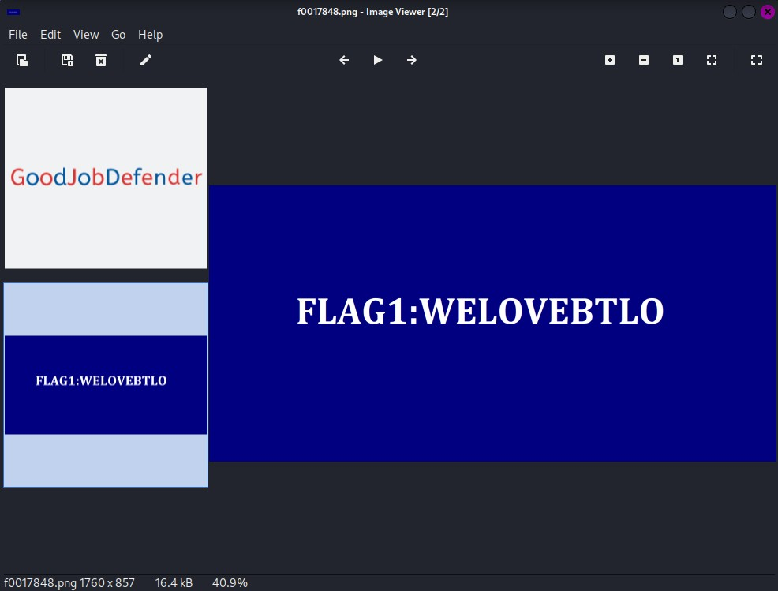
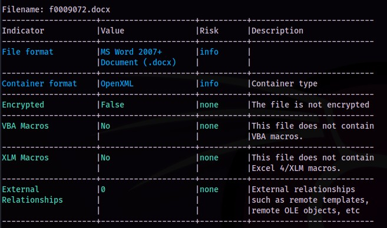
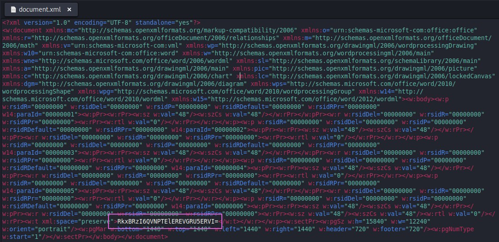
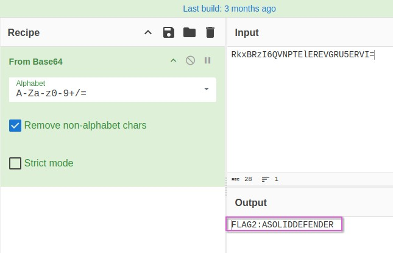
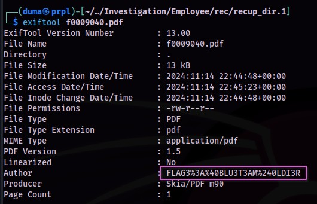
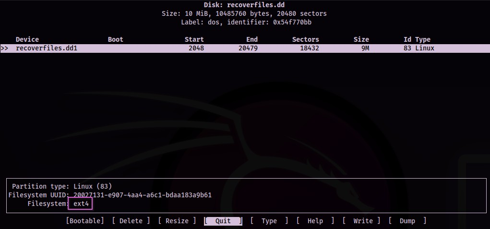
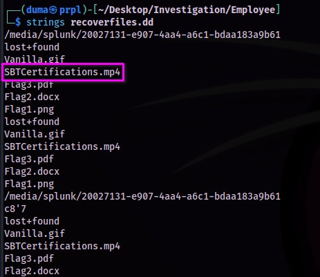

+++
title = "Employee of the Year"
date = "2024-11-15T01:45:33Z"
draft = false
categories = ["cybersecurity", "write-up"]
featuredImage = "/images/cybersec.jpeg"
tags = ["labs", "btlo" ]
keywords = ["cybersecurity", "labs", "btlo", "write-up"]
author = "{{ .Site.Params.Author }}"
+++

This is my write-up for the retired Blue Team Labs Online challenge 'Employee of the Year'.

## Scenario:

On a Friday evening when you were in a mood to celebrate your weekend, your team was alerted with a new RCE vulnerability actively being exploited in the wild. You have been tasked with analysing and researching the sample to collect information for the weekend team.

## Process of Investigation:

This challenge took some additional work before I could start work on the investigation. After downloading and extracting the contents of the challenge zip file, there was just one file, 'recoverfiles.dd'.

I have only been using Linux as my daily driver for about 6 months now, so there's a lot to learn, and I initially spent far too long trying to mount the image file, without success. Or rather, I managed to get the image file mounted, but it was always showing as empty, with no folder structure, and no files.
It was while I was trying to research why the image was showing empty while mounted, I discovered, that I could have saved a lot of time. I could have just used a simple command to verify what some data contained may be, and so I did just that.

Using ```strings recoverfiles.dd``` I could see some information from the disk image.
While a lot of the data is unreadable, due to the file being a binary file, there was some readable text, some filenames, and folders.



Some of this data can be extracted with ```scalpel```, but first the configuration file would need to be edited, so that the scalpel application can recover .gif image types, by removing the hash '#' comment indicators.
```bash
sudo nano /etc/scalpel/scalpel.conf
```


After saving the changes to the configuration file, I created a directory to hold the recovered data, within my investigation directory, then ran scalpel against the disk image file.
```bash
mkdir recovery
scalpel -o recovery recoverfiles.dd
```

A directory containing the recovered files, and an audit text file, were created in the selected directory.
In the ```gif-1-0``` directory that was created, I saw a single .gif file.
The file did not load all the frames when opening up in an image viewer, but there was a frame containing the text “GoodJobDefender”.



There wasn't much more I could get from using scalpel, unless I knew the extensions of the files that I wanted to retrieve.
There was another tool that could be of use here, though. ```Photorec``` can help recover lost files from disk drives.

I created a directory to store the recovery files, then I ran photorec against the ```recoverfiles.dd``` file.
```bash
mkdir rec
sudo photorec recoverfiles.dd
```

Photorec presents several menu options at each step through the process:
1. Selecting the media source.
2. Selecting disk or partition.
3. The filesystem type.
4. To analyse all space or free space.
5. Destination directory to recover the files to.

I now had several files recovered to look through.
```bash
-rw-r--r-- 1 root root  93K Nov 14 22:44 f0008848.gif
-rw-r--r-- 1 root root  13K Nov 14 22:44 f0009040.pdf
-rw-r--r-- 1 root root 6.1K Feb 12  2021 f0009072.docx
-rw-r--r-- 1 root root 732K Nov 14 22:44 f0016384.mp4
-rw-r--r-- 1 root root  17K Nov 14 22:44 f0017848.png
-rw-r--r-- 1 root root 3.2K Nov 14 22:45 report.xml
```

I started with the other image file that had been recovered, 'f0017848.png'. This image just contained the text “FLAG1:WELOVEBTLO”. I checked the metadata with ```exiftool``` of both of these files, and no additional information was recovered.



The metadata for the .docx file also didn't provide any helpful data. Running the file against ```oleid``` I saw that the file wasn't encrypted, contained no VBA or XLM macro’s or any external relationships. I still didn't want to open the file directly, though.



Listing the contents of the file with ```unzip``` from the terminal shows there is data to be extracted, now to get to that data using
```bash
unzip f0009072.docx
```

With that, the files were extracted. The file I was interested in was 'document.xml' as this would be the likely location for any text in the document to be stored.


There was not much in the XML file, but there was text, which appeared to be base64 encoded.



The text was base64 encoded, and after putting it through CyberChef, I got the plaintext result- ”FLAG2:ASOLIDDEFENDER”.



I didn't find any further information from the DOCX file, so now I moved on to the PDF document.

I started with passing the file through ```exiftool```, and the document author metadata is displayed as “FLAG3%3A%40BLU3T3AM%240LDI3R”.



This text would need to be cleaned up first, so I put the text in to the ```URL-formatted strings decoder``` from ```IT-Tools```, and got the cleaned text “FLAG3:@BLU3T3AM$0LDI3R”.

Finding the filesystem of the disk image took some work. I didn't see anything definitive for the filesystem when using ```photorec```, and trying with ```fdisk```, ```blkid```, and ```kpartx```, didn't provide the information either.
However, after some web searching, I found an article on [askubuntu.com](https://askubuntu.com/questions/1279716/how-to-open-dd-file-to-analyze-it) that indicated using ```cfdisk``` could be the answer, and it was the answer, displaying ```ext4``` as the filesystem after running
```bash
cfdisk recoverfiles.dd
```



Finally, as I had done with all the other files, I started with 'f0016384.mp4' by running ```exiftool``` against it.

To find the original filename of the recovered mp4 file, I went back to my first step of this process, when getting some initial data from the image file. The strings gave me several filenames, and the number of files and the extensions of these files, matched the number of files, and extensions recovered.
Looking at this, I could see that the mp4 file in the original results was named 'SBTCertifications.mp4'.



# Challenge Questions and Answers:

1. What is the text written on the recovered gif image? ```GoodJobDefender```
2. Submit Flag1: ```FLAG1:WELOVEBTLO```
3. Submit Flag2: ```FLAG2:ASOLIDDEFENDER```
4. Submit Flag3: ```FLAG3:@BLU3T3AM$0LDI3R```
5. What is the filesystem of the provided disk image? ```ext4```
6. What is the original filename of the recovered mp4 file? ```SBTCertifications.mp4```

# References:

- https://blueteamlabs.online/
- https://www.securityblue.team/
- https://gchq.github.io/CyberChef/
- https://it-tools.tech/
- https://manpages.ubuntu.com/manpages/xenial/man8/kpartx.8.html
- https://askubuntu.com/questions/1279716/how-to-open-dd-file-to-analyze-it
