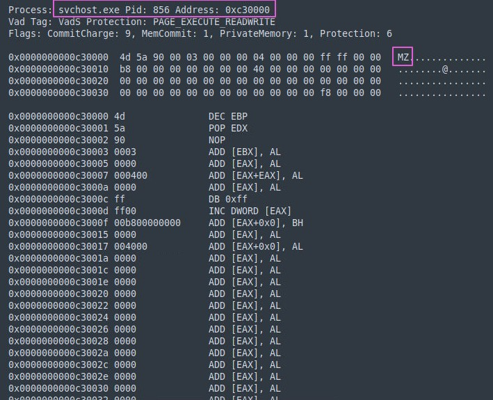
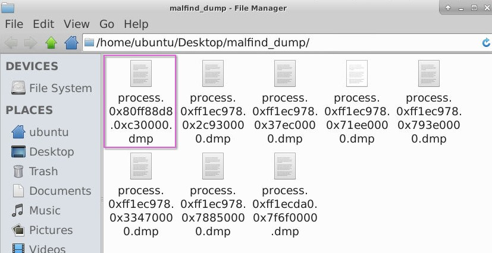
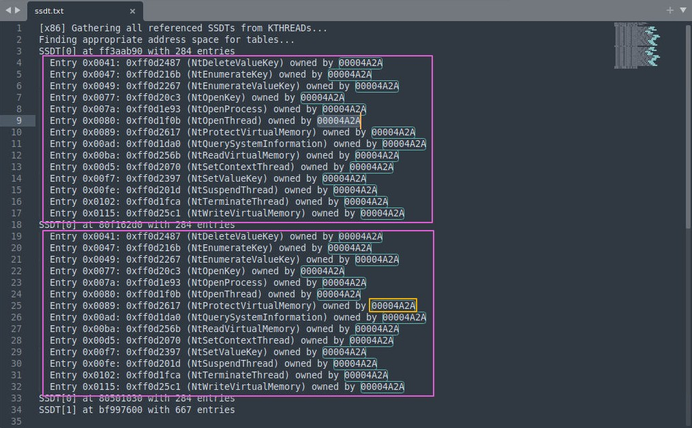

+++
title = "Nonyx"
date = "2024-11-15T18:33:33Z"
draft = false
categories = ["cybersecurity", "write-up"]
featuredImage = "/images/cybersec.jpeg"
tags = ["labs", "btlo" ]
keywords = ["cybersecurity", "labs", "btlo", "write-up"]
author = "{{ .Site.Params.Author }}"
+++

This is my write-up for the retired Blue Team Labs Online investigation 'Nonyx'.
The investigation is now retired, so it can still be completed towards achievements, and public write-ups are now permitted.

## Scenario:

Purify Black Energy 2 from Shadowbrook’s digital infrastructure by reverse-engineering the malware’s code.

## Process of Investigation:

When the investigation environment loads, there are a few files and directories already on the desktop. There were directories for the applications CyberChef and volatility, and files readme.txt file, and a 'BlackEnergy.vnem'.

The readme file was small, and only contained the text:
```
WinXPSP2x86 is the profile you must use.
It is best to place the output of the vol2 commands to a .txt file for better readability.
```

Volatility was provided on the desktop of the investigation, so I started with running ```volatility``` and the ```pslist``` command, with the profile 'WinXPSP2x86' as suggested by the readme file, against the image file, then saving the output to a text file.
```bash
python vol.py --profile=WinXPSP2x86 -f /home/ubuntu/Desktop/BlackEnergy.vnem pslist > processes.txt
```

This gave me a list of processes, with offsets, PIDs, etc, but it didn't show anything obvious that would answer the first question, Which process most likely contains injected code, providing its name, PID, and memory address?.
There was more to do to get this answer.


I next ran the ```malfind``` command as part of ```volatility``` to get a view of any potential process injections.
```bash
python vol.py --profile=WinXPSP2x86 -f ~/Desktop/BlackEnergy.vnem malfind > ~/Desktop/malfind.txt
```

The results display several processes, along with the PID and memory address, the header including addresses, and the HEX values, as well as some Assembly instructions.
Reviewing the results, one in particular stands out. Process ```svchost.exe``` shows the HEX value 4d5a in the header, which has the ASCII value 'MZ'.



An executable file header, specifically .exe formats, can be identified my the MZ at the start of the header file, which I confirmed with [fileformat.info](https://www.fileformat.info/format/exe/corion-mz.htm). Other processes from .exe files do not contain this header, so this would indicate that this process is the victim of Portable Executable Injection.

With the process confirmed, I now ran the same ```malfind``` command again, but this time using the -D parameter, so that I could get a dump file of the processes.
```bash
python vol.py --profile=WinXPSP2x86 -f ~/Desktop/BlackEnergy.vnem malfind -D ~/Desktop/malfind_dump
```

This gave me dump files from all the processes, so to answer question two, I looked for the dump file that had the memory address of the process in the name, in this case 'process.0x80ff88d8.0xc30000.dmp'.



Next, I wanted to get the strings output of the dump file, to look at identifying the filename path referenced. I pushed the output to a text file, for easier review.
```bash
strings process.0x80ff88d8.0xc30000.dmp >> dmp_strings.txt
```

Looking through the text file, there was a lot of binary data. Further down I started seeing the function calls that could be used through, then I got to what appeared to be the start of the PE, and where the MZ header would be. This line of text gave the full path and filename 'C:WINDOWSsystem32driversstr.sys'.


Question 4 was to find how many functions were hooked, and by which module, using the SSDT plugin. I am still extremely new to this field, having just started learning, so I did have to web search a little to find out more about SSDT.
According to this [GitHub repository](https://github.com/volatilityfoundation/volatility/wiki/Command-Reference#ssdt), I found that the plugin will list functions in the native and GUI System Service Descriptor Tables. These tables are basically an array of addresses to kernel routines for 32-bit operating systems, and for 64-bit operating systems, are relative offsets for the same routines.

So I ran the ```volatile``` command to get this SSDT data, using 
```egrep -v '(ntoskrnl|win32k)```
and outputting this to a text file.
```bash
python vol.py --profile=WinXPSP2x86 -f ~/Desktop/BlackEnergy.vnem ssdt | egrep -v '(ntoskrnl|win32k)
```

After the process was complete, looking at the text file, I saw two SSDT entries. Both had different addresses, but both had the same number of function calls, and all of them owned by the same HEX value. There were 14 functions hooked, and each owned by module '00004A2A'.



I spent far longer with question 5 than I should have done. I was searching for ways of trying to pass the output of ```ssdt``` to ```modules``` before I finally realised, it meant just the module that was found in Q4. Too much overthinking the question, and not reading it again, and fully understanding what was being asked.

Now I had figured out I didn't need to pass anything, I just ran the ```vol.py``` command, switching out the plugin for ```modules``` and outputting to a new text file, then reading the file with ```cat``` and ```grep``` to find the '00004A2A' module.
```bash
python vol.py --profile=WinXPSP2x86 -f ~/Desktop/BlackEnergy.vnem modules >> ../modules.txt
cat ../modules.txt | grep "00004A2A"
```

There was only one entry, listed in columns Offset, Name, Base, Size, and File. Based on this, I could see that the base address was '0xff0d1000'.


Almost at the end, now it was to get the hash in question. For this, I needed to get access to a file, so I went back to the volatility command reference repository I had found. This let me know that the ```moddump``` plugin will extract a kernel driver to a file, as long as a destination directory was supplied. With using the --base tag too, I could provide the base address and just get the particular driver I was looking for.

I ran the command to dump out the file, then used ```sha256sum``` to get the hash value.
```bash
python vol.py --profile=WinXPSP2x86 -f ~/Desktop/BlackEnergy.vnem moddump --base=0xff0d1000 -D ../mod_dump
sha256sum ../mod_dump/driver.ff0d1000.sys
```


# Challenge Questions and Answers:

1. Which process most likely contains injected code, providing its name, PID, and memory address? (Format: Name, PID, Address): ```svchost.exe, 856, 0xc30000```
2. What dump file in the malfind output directory corresponds to the memory address identified for code injection? (Format: Output File Name): ```process.0x80ff88d8.0xc30000.dmp```
3. Which full filename path is referenced in the strings output of the memory section identified by malfind as containing a portable executable (PE32/MZ header)? (Format: Filename Path): ```C:\WINDOWS\system32\drivers\str.sys```
4. How many functions were hooked and by which module after running the ssdt plugin and filtering out legitimate SSDT entries using egrep -v '(ntoskrnl|win32k)'? (Format: XX, Module): ```14, 00004A2A```
5. Using the modules (or modscan) plugin to identify the hooking driver from the ssdt output, what is the base address for the module found in Q4? (Format: Base Address): ```0xff0d1000```
6. What is the hash for the malicious driver from the virtual memory image? (Format: SHA256): ```12b0407d9298e1a7154f5196db4a716052ca3acc70becf2d5489efd35f6c6ec8```

# References:

- https://blueteamlabs.online/
- https://www.securityblue.team/
- https://github.com/volatilityfoundation/volatility
- https://www.fileformat.info/format/exe/corion-mz.htm
- https://github.com/volatilityfoundation/volatility/wiki/Command-Reference#ssdt
- https://www.ired.team/miscellaneous-reversing-forensics/windows-kernel-internals/glimpse-into-ssdt-in-windows-x64-kernel
