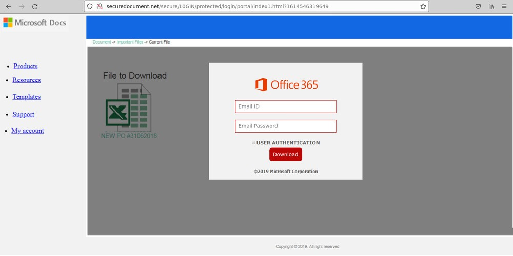
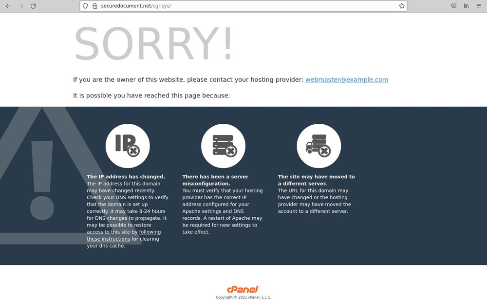
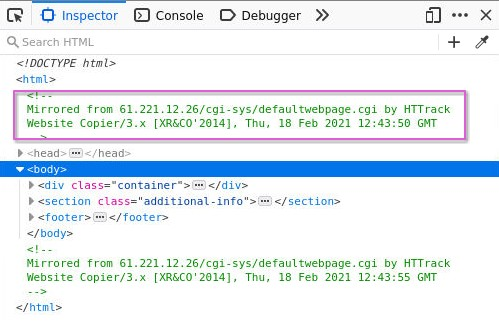
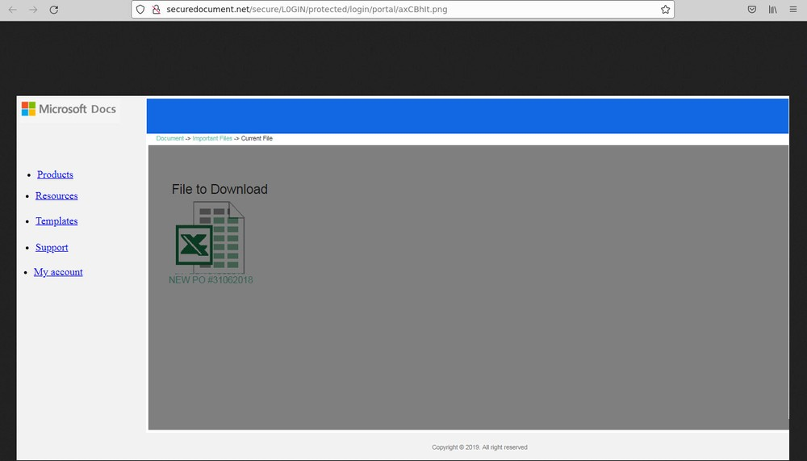
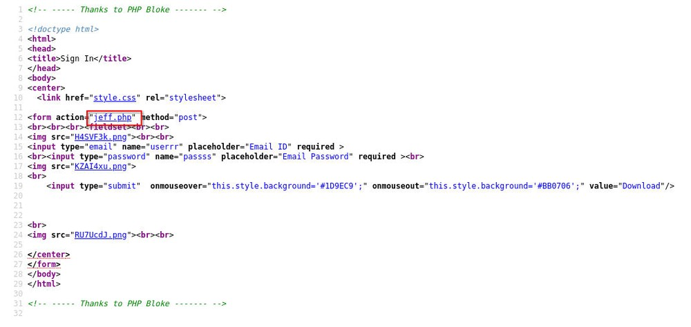
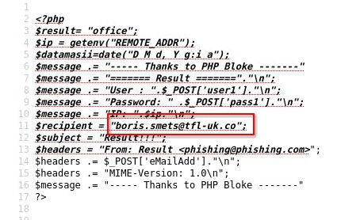

+++
title = "Phishy V1"
date = 2024-11-22T16:36:33+01:00
lastmod = 2025-08-02T23:07:45+01:00
draft = false
categories = ["Cybersercurity", "Writeup", "BTLO", "Security Operations", "Investigation"]
tags = ["Web Browser", "Text Editor", "Linux CLI", "T1566", "T1598"]
platform = "Blue Team Labs Online"
difficulty = "Easy"
machine_name = "Phishy V1"
+++

## Scenario:

You have been sent a phishing link. Sadly the threat actor doesn’t know who they were dealing with. From only one phishing link find out all you can about the person responsible and bring them to justice.

❗ **WARNING**
The website and kit in this lab is REAL.  
Exercise caution when interacting with the malicious website and do not enter any sensitive information!

ℹ️ **INFO**
As the website referenced is a live website, any references, or links to URLs, IP addresses etc in this write-up have been ‘defanged’. I do not hold any responsibility for anyone using these links.

---

## Process of Investigation:

After starting the lab, there was a ‘read me’ text file on the desktop. The contents of the text file are just stating that a phishing link has been sent, and the task is to find as much out about the person responsible, from using only the URL we have been provided.


I opened up a web browser, and went to the URL provided, and the site loaded up, it had been made to look like a Microsoft Office 365 file download page.



Question 1 asks for the source of the mirror that is used on the host domain, and the first art of the tool used, so loading the page in the browser, it looked like many other error pages.



Loading up the Inspector Developer Tool, I saw comments in the HTML that the page is being mirrored from `61[.]221[.]12[.]26/cgi-sys/defaultwebpage[.]cgi` by the tool `HTTrack Website Copier`.



Question 2 took me back to the phishing landing page to find the full URL of the background image. On this page, right clicking on the background, then opening the image in a new tab, loaded the page and displayed `hxxp[://]securedocument[.]net/secure/L0GIN/protected/login/portal/axCBhIt[.]png` in the address bar.



Viewing the page source for the phishing landing page, a form action pointed to `jeff.php` and with that, I had my answer to question 3.



Question 4 took a little investigating, as I had to find the zip file for the phishing kit. I didn’t see this in the page source for the domain page, or the phishing page, so I started working backwards through each folder in the URL. Eventually, I saw `0ff1cePh1sh.zip` in the index of `/secure/`.


I saved this to a folder on my desktop for investigation, then ran the sha256sum command against it.

```bash
sha256sum 0ff1cePh1sh.zip
```

This returned the hash `c778236f4a731411ab2f8494eb5229309713cc7ead44922b4f496a2032fa5b48`, giving me my answer.


To answer question 5 meant going into the php script and looking at the source. Here I identified a reference $recipient being assigned the email address `boris[.]smets[@]tfl-uk[.]co`.



Question 6 took a little time to figure out, and being honest, I sort of stumbled upon it. Initially, I thought the string of numbers at the end of the URL were a basic reference number. However, I noticed that this number would be different, depending on which URL I entered, and this number increased each time. I then suspected that this may be a time reference, so then checking the landing page source, I didn’t see anything, so I went back through each part of the full URL again, checking the source each time. The source for `/portal/` showed a JavaScript function that adds `Date().getTime()` to the URL.


Question 7 brought me back to the php file, as I had seen a URL in there, and it would be `office.com` that would be loaded in the browser, once credentials had been entered.


Question 8 asked for the variable name that was wrong, causing the site to break, but I noticed a couple of variables that were incorrect. The HTML page had `userrr` and the PHP file was looking for `user1` so I set this for my answer.


---

## Challenge Questions and Answers:

1. The HTML page used on securedocument[.]net is a decoy. Where was this webpage mirrored from, and what tool was used? `61[.]221[.]12[.]26/cgi-sys/defaultwebpage[.]cgi, HTTrack`
2. What is the full URL of the background image which is on the phishing landing page? `hxxp[://]securedocument[.]net/secure/L0GIN/protected/login/portal/axCBhIt[.]png`
3. What is the name of the php page which will process the stolen credentials? `jeff.php`
4. What is the SHA256 of the phishing kit in ZIP format? `fa5b48`
5. What email address is setup to receive the phishing credential logs? `boris[.]smets[@]tfl-uk[.]co`
6. What is the function called to produce the PHP variable which appears in the index1.html URL? `Date().getTime()`
7. What is the domain of the website which should appear once credentials are entered? `office.com`
8. There is an error in this phishing kit. What variable name is wrong causing the phishing site to break? `userrr`

---

## References:

- https://blueteamlabs.online/
- https://www.securityblue.team/
